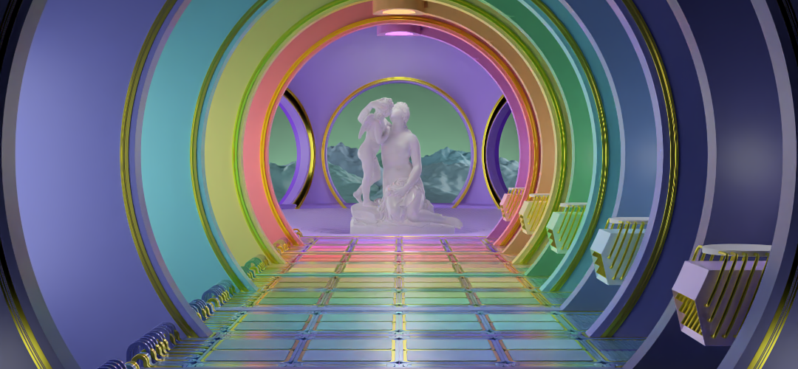
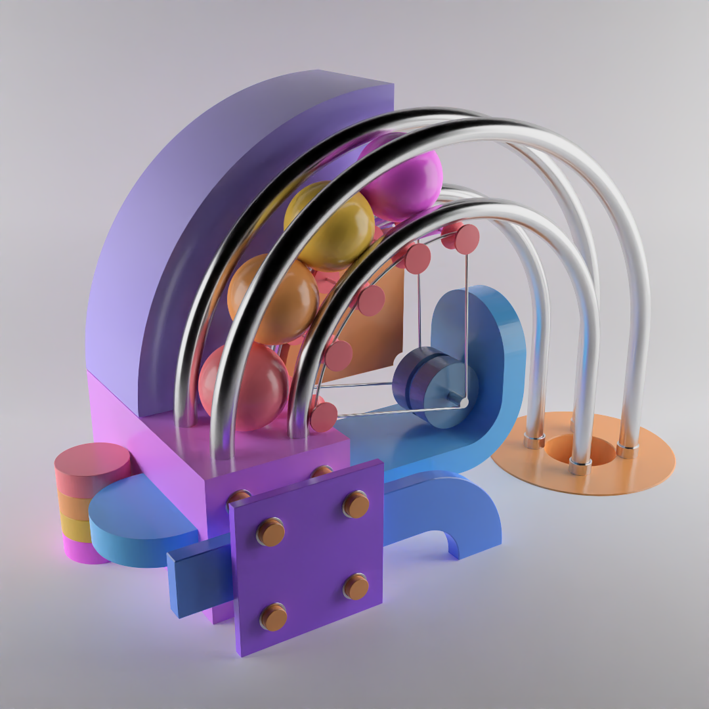
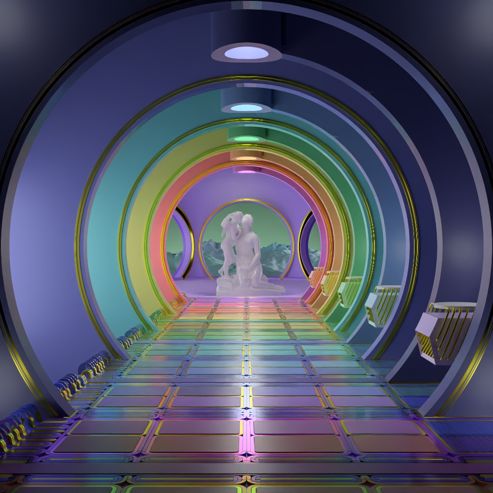
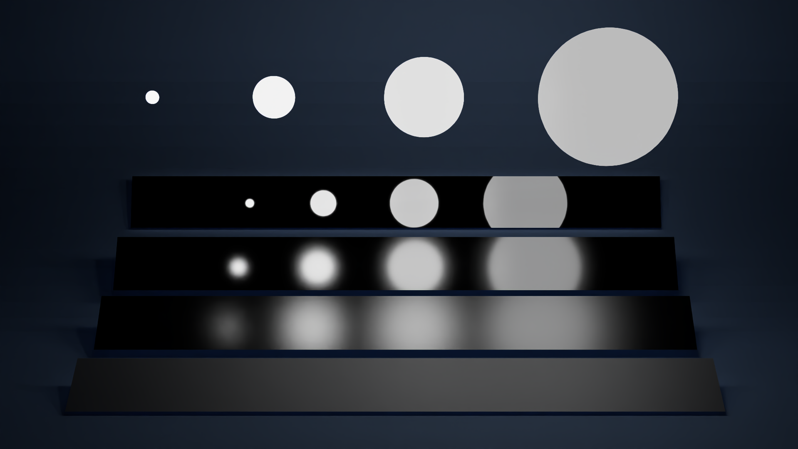
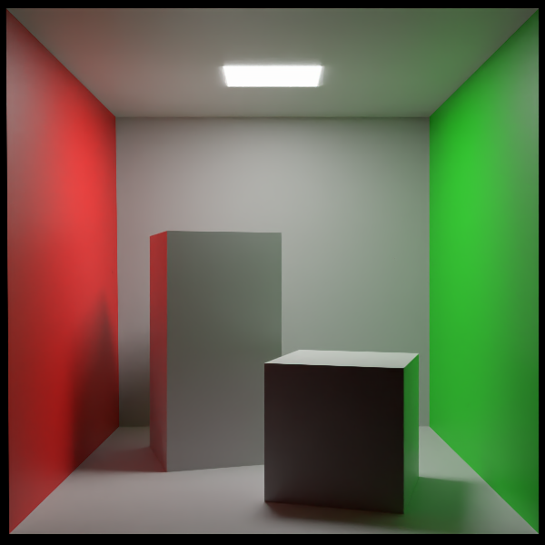
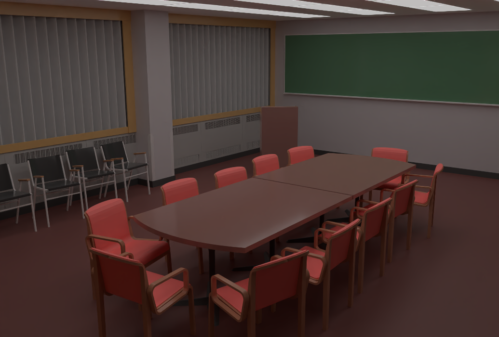

# rayme (early alpha)


A path tracing renderer for static glTF 2.0 scenes.

## Examples
Some scenes produced using **rayme** (all images produced with 1024 samples per pixel, denoising,
and no auto-exposure):

A scene with different materials (scene designed by [Ariel Monti](https://www.ariel.life/))


A more complex scene, with many light sources (scene designed by
[Ariel Monti](https://www.ariel.life/))


A typical test scene, showcasing the behavior of different roughnesses in the presence of
lights of different sizes:


A Cornell box (adapted from
[J.D.B. Walter's model](https://github.com/wahn/export_multi/tree/master/00_cornell_box)):


The [Conference Room](https://github.com/wahn/export_multi/tree/master/04_conference_room)
scene (created by Anat Grynberg and Greg Ward):


## Dependencies
The program requires the Boost library to build.
Note for Windows users: rayme depends on Boost.ProgramOptions, which is one of [the few](https://www.boost.org/doc/libs/1_78_0/more/getting_started/windows.html#header-only-libraries) Boost libraries needing separate compilation. See [the Boost documentation](https://www.boost.org/doc/libs/1_78_0/more/getting_started/windows.html#prepare-to-use-a-boost-library-binary) for further details.
### Optional dependencies
In order to have the deniosing option available (recommended), the library
[Intel(R) Open Image Denoise](https://www.openimagedenoise.org/) is required (see also
the project's [GitHub page](https://github.com/OpenImageDenoise/oidn)); precompiled
binary packages can be downloaded [here](https://www.openimagedenoise.org/downloads.html).
On Arch Linux, it can be installed from the repositories, by running `pacman -S openimagedenoise`.

## Build
### On Linux
Clone the repository using git's `--recurse-submodules` option, then, in the project folder, run
```
cmake -S . -B build/ && cd build/
make
```
the executable `rayme` will be availale in the `build` folder.
If building fails, try running
```
cmake -DNO_AVX512=ON -S . -B build/ && cd build/
make
```
instead (the program by default uses the AVX512 set of instructions, which might be incompatible
with some older CPUs).

### On Windows
Make sure to be able to run `cmake.exe` through the PowerShell (e.g. by installing the [CMake tools module](https://docs.microsoft.com/en-us/cpp/build/cmake-projects-in-visual-studio?view=msvc-170#installation)) in Visual Studio.
Clone the repository, either through Visual Studio or via command line using git's `--recurse-submodules` option. Then, in the project folder, run (using the PowerShell)
```
> cmake -DBOOST_ROOT="[boost directory (typically, C:/Program Files/Boost/boost_1_XX_0)]" -DBOOST_LIBRARYDIR="[boost directory]" -A x64 -DCMAKE_BUILD_TYPE=Release -S . -B build/

> cd .\build\

> cmake --build . --target ALL_BUILD --config Release -- /maxcpucount
```
the executable `rayme.exe` will be availale in the `build\Release` folder. If building fails, try running
```
> cmake -DBOOST_ROOT="C:/Program Files/Boost/boost_1_78_0" -DBOOST_LIBRARYDIR="C:/Program Files/Boost/boost_1_78_0" -A x64 -DCMAKE_BUILD_TYPE=Release -DNO_AVX512=ON -S . -B build/

> cd .\build\

> cmake --build . --target ALL_BUILD --config Release -- /maxcpucount
```
instead (the program by default uses the AVX512 set of instructions, which might be incompatible
with some older CPUs).

## Usage
```
rayme [-i] gltf-file [options]
```
For example:
```
rayme scene.gltf -H 1080 -s 512 -o rendered-scene
```
### Available options
- `-h, --help`, outputs a help message,

- `-i, ``input-filename`, specify name of the input glTF 2.0 file (including extension),

- `-H, --height`, specify height (in pixels) of the output image (default: 400),

- `-s, --spp`, specify the number of samples per pixel (default: 128),

- `-d, --min-depth`, specify the minimum number of ray bounces (default: 5),

- `-e, --auto-exposure`, apply automatic exposure (experimental, disabled by default),

- `-N, --no-denoise`, disable image denoising (available only if Intel(R)'s Open Image Denoise
  library is installed before building the project),

- `-o, --output-filename`, specify name of the output PNG file (without extension)".

Currently, fine-grained exposure control is not supported. If a render results too dark or too
bright, try enabling the auto-exposure feature (still experimental).

## glTF 2.0 compliance
The program expects valid glTF 2.0 files as input and does not guarantee any validation, hence
providing invalid inputs will result in undefined behavior (most likely a crash).
Currently, only a subset of glTF 2.0's core specification is supported, and none of its extensions.

The support is in undergoing expansion; the biggest current restrictions are:

- Only text-encoded glTF files are supported (both with external binary data and with
 embedded Base64-encoded binary data); glb files are currently not supported;

- The only primitives supported are triangle meshes; in particular, emissive meshes are the only
  kind of lights currently supported;

- Alpha channels (and related transparency information) are currently ignored;

- Image textures are currently not supported.